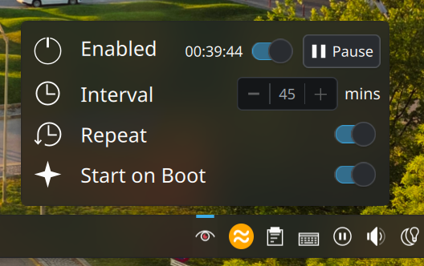
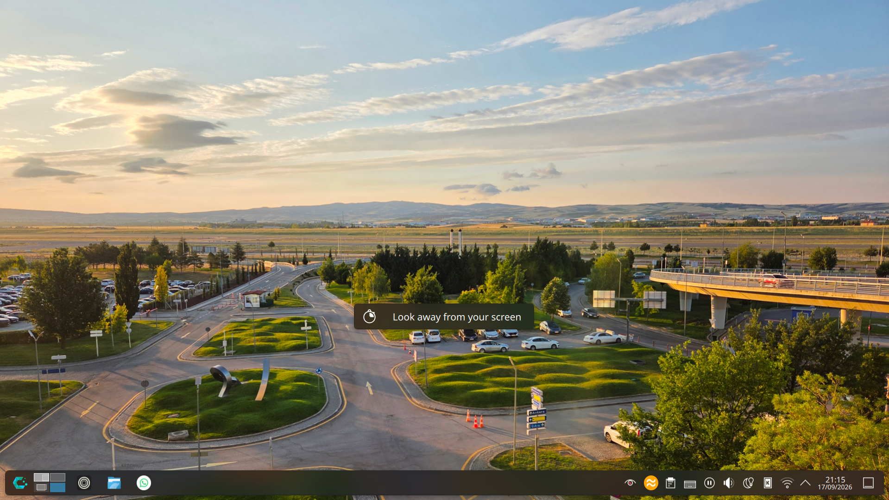

# LookAway

A widget to remind you to look away from your screen.

### Installation

#### Method 1

Install it from the `Get New...` button on KDE edit mode.

#### Method 2

Install the zip from the `Get New...`'s `Install widget from local file`

#### Method 3

Move the `plasmoid` folder in `~/.local/share/plasma/plasmoids/` (Create the `plasmoids` folder if it doesn't exist), then rename it `com.neznak.LookAway`.
